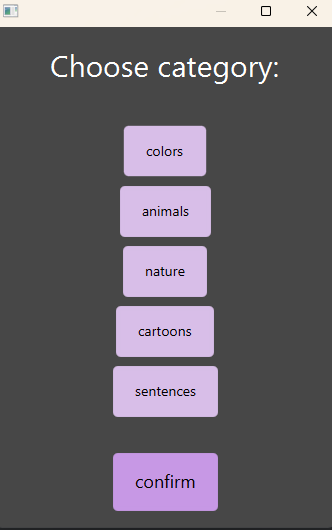
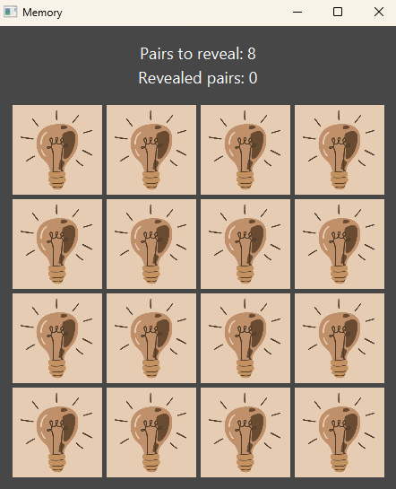

# Memory Game

**Memory Game** is a classic matching-pairs puzzle game.  
The goal is to find all pairs of matching cards — test your memory!  
Each game is unique thanks to random card placement and customizable settings.

## Welcome Screen
When you launch the game, you’re greeted with a welcome screen inviting you to start your memory challenge.

## Category Selection
Choose from different **categories** of images before starting your game.

## Difficulty Selection
Select a **difficulty level** — Easy, Medium, or Hard — which determines the size of the board and the number of pairs to find.

## Game Board
At the beginning, all cards are hidden.  
Click to reveal two at a time and try to find matching pairs.

## During the Game
You can see how many pairs you’ve already found and how many are left.

## You Won Screen
When you match all pairs correctly, the game congratulates you with a victory screen. 🎉

## Features
- Choose from multiple **image categories**
- Three **difficulty levels**: Easy, Medium, Hard
- **Counters** showing how many pairs have been found and how many remain
- **Randomized card layout** for every new game
